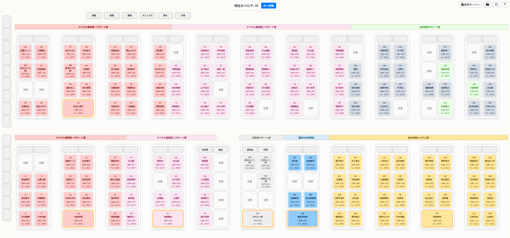
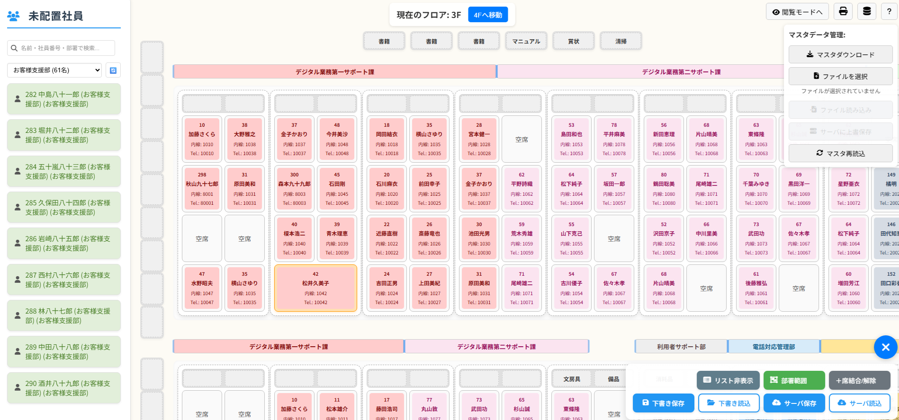
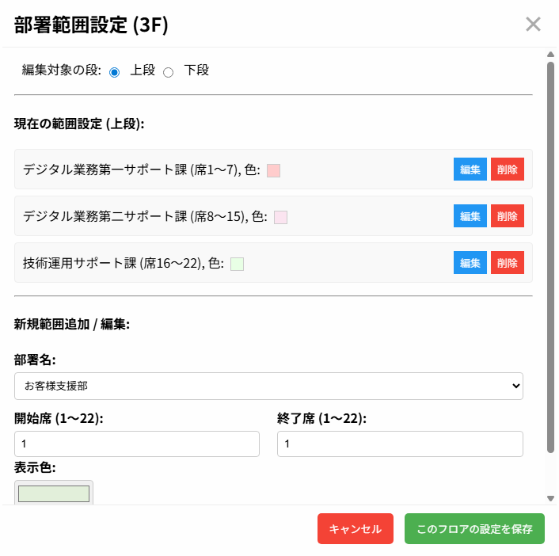
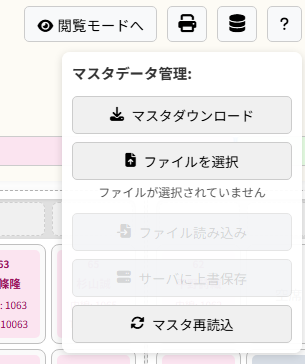
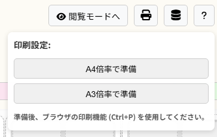

# 🏢 Office Layout Manager - Multi-Floor Seating Management System

> **オフィス座席管理システム**  
> ドラッグ&ドロップによる直感的な座席配置、マルチフロア対応、リアルタイム同期機能を備えたWebアプリケーション

[](https://nodejs.org/)
[](https://expressjs.com/)
[](https://developer.mozilla.org/en-US/docs/Web/JavaScript)
[](https://www.docker.com/)


> ※ スクリーンショット内の社員名・部署名は全て架空のものです

## 🎯 プロジェクト概要

**Office Layout Manager**は、中小企業のオフィス座席管理を効率化するためのWebアプリケーションです。  
直感的なドラッグ&ドロップインターフェースにより、複数フロアにわたる座席配置を簡単に管理できます。

### 🏢 想定利用シーン
- **オフィス座席管理**: 複数フロアでの社員座席配置
- **部署別レイアウト**: 組織変更に対応した柔軟な座席再配置
- **印刷対応**: 会議室・受付での座席表掲示
- **マスターデータ管理**: 社員情報の一元管理

---

## ✨ 主要機能

### 🖱️ **直感的ドラッグ&ドロップ**
- マウス操作による簡単な座席配置
- 未配置社員リストから座席への直接ドラッグ
- 座席間での社員移動
- リアルタイムでの配置状況更新

### 🏗️ **マルチフロア対応**
- **複数フロア管理**: 3F・4F など複数フロアの独立管理
- **フロア切り替え**: ワンクリックでのフロア間移動
- **フロア別設定**: 各フロア独自の部署ゾーン・座席配置

### 🎨 **部署・チーム可視化**
- **色分け表示**: 部署・チーム別の自動色分け
- **部署ゾーン設定**: 座席範囲を部署別にグループ化
- **フィルタリング**: 部署別での社員検索・表示

### 💺 **高度な座席管理**
- **座席結合・分割**: 複数席を連結した配置
- **座席メモ機能**: 特記事項の記録
- **配置履歴**: アンドゥ・リドゥ機能

### 🔐 **安全なデータ管理**
- **自動バックアップ**: データ変更時の自動タイムスタンプバックアップ
- **バージョン管理**: 同時編集における競合検出・解決
- **マスターデータ管理**: 社員情報のインポート・エクスポート

### 🖨️ **印刷・出力機能**
- **A3/A4対応**: 用紙サイズに応じた最適化
- **マスターデータエクスポート**: JSON形式でのデータダウンロード
- **下書き保存**: ブラウザローカルでの一時保存

### 👥 **デュアルモード**
- **閲覧モード**: 座席表の参照専用
- **管理モード**: 座席配置・設定変更可能
  - **セキュリティ**: 実際の運用環境では管理モード移行時のパスワード認証を実装推奨

---

## 🛠 技術スタック

### **Backend**
- **Node.js 18+** - サーバーサイドランタイム
- **Express 4.18** - Webアプリケーションフレームワーク
- **fs-extra** - ファイルシステム操作
- **fast-json-patch** - JSONデータの差分管理

### **Frontend**
- **Vanilla JavaScript** - フレームワークレスの軽量実装
- **HTML5 / CSS3** - モダンWeb標準
- **Font Awesome** - アイコンライブラリ
- **Drag & Drop API** - ネイティブドラッグ&ドロップ

### **Data Management**
- **JSONファイルベース** - シンプルなデータ永続化
- **自動バックアップシステム** - 最大10世代の履歴保持
- **バージョン管理** - 楽観的ロック機構

### **Infrastructure**
- **Docker** - コンテナ化による環境統一
- **CORS対応** - クロスオリジン通信
- **ファイル監視** - 設定変更の自動検出

---

## 🚀 クイックスタート

### 前提条件
- Node.js 18+
- Docker（推奨）

### Docker起動（推奨）
```bash
# リポジトリクローン
git clone https://github.com/piyopiyo-maru/office-layout-app.git
cd office-layout-app

# Dockerイメージビルド
docker build -t office-layout-app .

# コンテナ起動
docker run -d -p 9000:9000 \
  -v /opt/office-layout-app/data:/usr/src/app/data \
  --name office-layout-container \
  office-layout-app
```

### ローカル開発
```bash
# 依存関係インストール
npm install

# 開発サーバー起動
npm start
```

### 接続確認
- **アプリケーション**: http://localhost:9000
- **操作マニュアル**: http://localhost:9000/manual.html

---

## 📸 機能スクリーンショット

### メイン画面（閲覧モード）

*座席配置の一覧表示・部署別色分け*

### 管理モード

*ドラッグ&ドロップによる座席配置編集*

### 部署ゾーン設定

*部署別の座席範囲設定・色分けカスタマイズ*

### マスターデータ管理

*社員情報のインポート・エクスポート*

### 印刷レイアウト

*A3/A4対応の印刷最適化表示*

---

## 🏗 システム構成

### アーキテクチャ図
```
┌─────────────────┐    ┌─────────────────┐    ┌─────────────────┐
│   Frontend      │    │   Backend       │    │   Data Layer    │
│   (Browser)     │◄──►│   (Express)     │◄──►│   (JSON Files)  │
│                 │    │                 │    │                 │
│ ・HTML5/CSS3    │    │ ・RESTful API   │    │ ・initial_data  │
│ ・Vanilla JS    │    │ ・CORS Support  │    │ ・layout_data   │
│ ・Drag & Drop   │    │ ・Version Mgmt  │    │ ・Auto Backup   │
└─────────────────┘    └─────────────────┘    └─────────────────┘
```

### データモデル
- **Employee Data**: 社員基本情報・部署・チーム
- **Layout Data**: 座席配置・結合情報・メモ
- **Department Zones**: 部署範囲・色分け設定
- **Version Control**: データ整合性・競合解決

### API エンドポイント
- `GET /api/initial-data` - マスターデータ取得
- `POST /api/initial-data` - マスターデータ更新
- `GET /api/layouts/default` - レイアウトデータ取得
- `POST /api/layouts/default` - レイアウトデータ更新
- `GET /api/download-initial-data` - データエクスポート

---

## 🎯 座席配置システム

### レイアウト仕様
- **総座席数**: 88席（フロア当たり）
- **島構成**: 22島（11島 × 2行）
- **座席構成**: 1島あたり4席（2×2配置）
- **対応フロア**: 3F・4F（拡張可能）

### 座席管理機能
1. **個別配置**: ドラッグ&ドロップによる1席ずつの配置
2. **座席結合**: 複数席を連結した大型配置
3. **座席分割**: 結合済み座席の個別分離
4. **配置解除**: 社員の座席からの除去

### 部署ゾーン機能
- **範囲指定**: 開始席〜終了席での部署領域設定
- **色分け**: 部署別カスタムカラー設定
- **階層管理**: フロア別・行別の独立設定

---

## 📊 データ管理・バックアップ

### 自動バックアップシステム
```bash
data/
├── initial_data.json          # 現在のマスターデータ
├── layout_data.json           # 現在のレイアウトデータ
└── backup/                    # 自動バックアップ
    ├── 2025-01-13T09-30-00-initial_data.json
    ├── 2025-01-13T09-30-00-layout_data.json
    └── ...（最大10世代保持）
```

### データ形式
**社員マスター**:
```json
{
  "employeeData": {
    "EMP001": {
      "name": "田中太郎",
      "dept": "システム部",
      "team": "開発チーム",
      "title": "エンジニア",
      "ext": "1001"
    }
  },
  "departmentColors": {
    "システム部": "#FF6B6B"
  },
  "teamColors": {
    "開発チーム": "#4ECDC4"
  }
}
```

**レイアウトデータ**:
```json
{
  "_version": 1,
  "layout": {
    "3F": {
      "seatMap": [ /* 座席配置配列 */ ],
      "mergedSeats": [ /* 結合座席情報 */ ],
      "departmentZones": {
        "topRow": [ /* 上段部署範囲 */ ],
        "bottomRow": [ /* 下段部署範囲 */ ]
      }
    }
  }
}
```

---

## 🧪 運用・保守

### Docker運用
```bash
# コンテナ状態確認
docker ps | grep office-layout

# ログ確認
docker logs office-layout-container

# コンテナ再起動
docker restart office-layout-container

# データバックアップ
docker cp office-layout-container:/usr/src/app/data ./backup
```

### 設定ファイル更新手順
1. ファイル変更後のDockerイメージ再ビルド
2. 既存コンテナの停止・削除
3. 新コンテナでの起動・動作確認

### トラブルシューティング
- **座席表示異常**: ブラウザキャッシュクリア
- **データ同期エラー**: サーバー再起動
- **配置操作不可**: 管理モードへの切り替え確認

---

## 🎨 カスタマイズ・拡張

### 新フロア追加
```javascript
// script.js内の設定変更
const floorIds = ['3F', '4F', '5F']; // 5F追加
```

### 座席レイアウト変更
```javascript
// 島数・座席数の調整
const totalIslands = 22; // 島数変更
const rows = 4, cols = 2; // 1島あたりの座席数
```

### 部署色設定
管理モード → マスターデータ管理 → 部署色設定にて変更可能

---

## 📈 パフォーマンス・スケーラビリティ

### 対象規模
- **社員数**: 300名以下
- **フロア数**: 2フロア
- **管理モード同時アクセス**: 5ユーザー以下

### 最適化手法
- **軽量実装**: フレームワークレスによる高速動作
- **効率的DOM操作**: 仮想DOMなしでの直接操作
- **ローカルキャッシュ**: 下書き保存でのレスポンシブ操作
- **差分更新**: JSON Patchによる最小データ通信

---

## 🔧 開発・デバッグ

### 開発者向けコマンド
```bash
# サーバー起動（ローカル）
npm start

# Dockerビルド
docker build -t office-layout-app .

# デバッグモード起動
NODE_ENV=development npm start
```

### ログ確認
- **アプリケーションログ**: ブラウザコンソール
- **サーバーログ**: `docker logs office-layout-container`
- **エラーログ**: サーバーコンソール出力

---

## 🤝 Contributing

1. フォークしてフィーチャーブランチ作成
2. コード変更・動作確認
3. Dockerテスト実行
4. プルリクエスト作成

### 品質基準
- **JavaScript**: ES6+標準準拠
- **セキュリティ**: XSS対策・入力値検証
- **ユーザビリティ**: 直感的操作・エラーハンドリング
- **ブラウザ対応**: モダンブラウザ（Chrome, Firefox, Safari, Edge）

---

## 📋 今後の計画

### Phase 1: 機能拡張
- [ ] モバイル対応（タッチ操作）
- [ ] 座席予約機能
- [ ] 通知システム

### Phase 2: エンタープライズ機能
- [ ] ユーザー認証・権限管理
- [ ] データベース統合（PostgreSQL/MySQL）
- [ ] REST API拡張

### Phase 3: AI・自動化
- [ ] 座席配置最適化アルゴリズム
- [ ] 部署間コミュニケーション分析
- [ ] 自動レイアウト提案

---

## 📄 ライセンス

ISC License - 詳細は[LICENSE](LICENSE)をご覧ください。

---

## 👤 開発者情報

**Atsushi Machida**
- GitHub: [@piyopiyo-maru](https://github.com/piyopiyo-maru)

### 💼 転職活動について
このプロジェクトは実用的なオフィス管理要件に基づいた開発経験を示すポートフォリオです。  
**直感的UI設計・データ管理・システム運用**の経験をご確認いただけます。

---