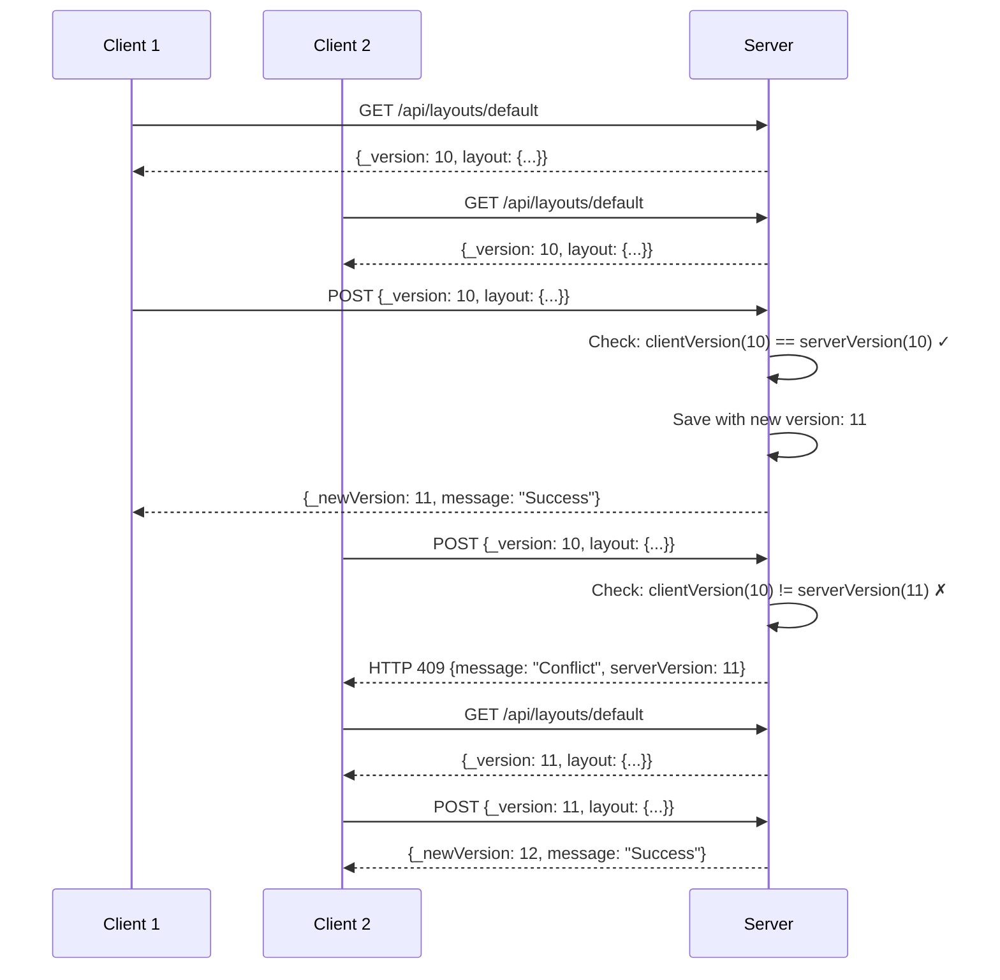

# API設計仕様

## 概要

オフィスレイアウト管理システムのAPI設計は、**シンプルなRESTful アーキテクチャ**に基づいています。  
5つの核心エンドポイントで全ての機能を実現し、楽観的ロック機構による安全な並行アクセスを保証します。

## API 設計原則

### 1. RESTful 設計原則
- **リソース指向**: データとレイアウトを明確に分離
- **HTTP動詞の適切な使用**: GET（取得）、POST（更新）
- **ステートレス**: サーバー側でセッション状態を保持しない
- **統一インターフェース**: 一貫したレスポンス形式

### 2. エラーハンドリング戦略
- **HTTP ステータスコード**: 適切なレスポンス
- **構造化エラーメッセージ**: 問題の特定と解決を支援
- **ログ記録**: デバッグとトラブルシューティング

### 3. バージョン管理
- **楽観的ロック**: `_version` フィールドによる競合制御
- **データ整合性**: 同時編集での意図しない上書き防止

## API エンドポイント詳細

### 1. マスターデータ管理API

#### **GET /api/initial-data**
社員マスターデータとカラー設定を取得

**Request:**
```http
GET /api/initial-data HTTP/1.1
Host: localhost:9000
Accept: application/json
```

**Response (Success - 200):**
```json
{
  "employeeData": {
    "EMP001": {
      "empNo": "EMP001",
      "name": "田中太郎",
      "title": "エンジニア",
      "dept": "システム部",
      "team": "開発チーム",
      "ext": "1001",
      "ctstage": "正社員"
    },
    "EMP002": {
      "empNo": "EMP002", 
      "name": "佐藤花子",
      "title": "デザイナー",
      "dept": "マーケティング部",
      "team": "UIチーム",
      "ext": "1002",
      "ctstage": "正社員"
    }
  },
  "departmentColors": {
    "システム部": "#FF6B6B",
    "マーケティング部": "#4ECDC4",
    "営業部": "#45B7D1"
  },
  "teamColors": {
    "開発チーム": "#FFA07A",
    "UIチーム": "#98D8C8",
    "セールスチーム": "#87CEEB"
  }
}
```

**Response (Error - 500):**
```json
{
  "message": "Server error: Could not get initial data.",
  "error": "ENOENT: no such file or directory, open 'data/initial_data.json'"
}
```

**実装:**
```javascript
app.get('/api/initial-data', async (req, res) => {
    try {
        const initialData = await getInitialData();
        res.json(initialData);
    } catch (error) {
        console.error('Server error in /api/initial-data:', error);
        res.status(500).json({ 
            message: "Server error: Could not get initial data.", 
            error: error.message 
        });
    }
});
```

#### **POST /api/initial-data**
社員マスターデータの完全更新

**Request:**
```http
POST /api/initial-data HTTP/1.1
Host: localhost:9000
Content-Type: application/json

{
  "employeeData": {
    "EMP001": {
      "empNo": "EMP001",
      "name": "田中太郎（更新）",
      "title": "シニアエンジニア",
      "dept": "システム部",
      "team": "開発チーム",
      "ext": "1001",
      "ctstage": "正社員"
    }
  },
  "departmentColors": {
    "システム部": "#FF6B6B"
  },
  "teamColors": {
    "開発チーム": "#FFA07A"
  }
}
```

**Response (Success - 200):**
```json
{
  "message": "Initial data successfully overwritten."
}
```

**Response (Error - 500):**
```json
{
  "message": "Server error: Could not save initial data.",
  "error": "Invalid field: invalidField for employee EMP001"
}
```

**バリデーション実装:**
```javascript
function validateEmployeeData(data) {
    const allowedFields = ['empNo', 'name', 'title', 'dept', 'team', 'ext', 'ctstage'];
    const maxLength = {
        empNo: 20, name: 50, title: 30, dept: 50, 
        team: 50, ext: 20, ctstage: 30
    };
    
    // HTMLタグ・スクリプト検出パターン
    const htmlPattern = /<[^>]*>/g;
    const scriptPattern = /<script\b[^<]*(?:(?!<\/script>)<[^<]*)*<\/script>/gi;
    const dangerousPatterns = [
        /javascript:/i, /vbscript:/i, /on\w+\s*=/i, /data:text\/html/i
    ];
    
    for (const empNo in data.employeeData) {
        const employee = data.employeeData[empNo];
        
        // 社員番号検証
        if (typeof empNo !== 'string' || empNo.length === 0 || empNo.length > 20) {
            throw new Error(`Invalid employee number: ${empNo}`);
        }
        
        // 各フィールド検証
        for (const key in employee) {
            if (!allowedFields.includes(key)) {
                throw new Error(`Invalid field: ${key} for employee ${empNo}`);
            }
            
            const value = employee[key];
            if (value !== null && value !== undefined) {
                if (typeof value !== 'string') {
                    throw new Error(`Field ${key} must be string for employee ${empNo}`);
                }
                if (value.length > maxLength[key]) {
                    throw new Error(`Field ${key} too long for employee ${empNo} (max: ${maxLength[key]})`);
                }
                if (htmlPattern.test(value) || scriptPattern.test(value)) {
                    throw new Error(`HTML/Script tags not allowed in field ${key} for employee ${empNo}`);
                }
                
                // 危険パターン検出
                for (const pattern of dangerousPatterns) {
                    if (pattern.test(value)) {
                        throw new Error(`Dangerous pattern detected in field ${key} for employee ${empNo}`);
                    }
                }
            }
        }
    }
    
    // カラー設定検証
    if (data.departmentColors) {
        for (const [dept, color] of Object.entries(data.departmentColors)) {
            if (typeof dept !== 'string' || dept.length > 50) {
                throw new Error(`Invalid department name: ${dept}`);
            }
            if (typeof color !== 'string' || !/^#[0-9A-Fa-f]{6}$/.test(color)) {
                throw new Error(`Invalid color format for department ${dept}: ${color}`);
            }
        }
    }
}
```

### 2. レイアウトデータ管理API

#### **GET /api/layouts/default**
全フロアのレイアウトデータを取得

**Request:**
```http
GET /api/layouts/default HTTP/1.1
Host: localhost:9000
Accept: application/json
```

**Response (Success - 200):**
```json
{
  "_version": 15,
  "layout": {
    "3F": {
      "seatMap": [
        [
          ["EMP001", "EMP002"],
          ["EMP003", null]
        ],
        [
          [null, "EMP004"],
          ["EMP005", "EMP006"]
        ]
      ],
      "mergedSeats": [
        {
          "island": 0,
          "mergedCells": [[0,0], [0,1]],
          "id": "merged_0_0_0_1"
        }
      ],
      "memoData": {
        "0-0-0": "プロジェクトリーダー席",
        "1-1-1": "新人研修用"
      },
      "departmentZones": {
        "topRow": [
          {
            "name": "システム部",
            "startSeat": 1,
            "endSeat": 11,
            "color": "#FF6B6B"
          }
        ],
        "bottomRow": [
          {
            "name": "営業部", 
            "startSeat": 1,
            "endSeat": 6,
            "color": "#45B7D1"
          }
        ]
      }
    },
    "4F": {
      "seatMap": [ /* 4Fのレイアウト */ ],
      "mergedSeats": [],
      "memoData": {},
      "departmentZones": {
        "topRow": [],
        "bottomRow": []
      }
    }
  }
}
```

#### **POST /api/layouts/default**
レイアウトデータの更新（楽観的ロック付き）

**Request:**
```http
POST /api/layouts/default HTTP/1.1
Host: localhost:9000
Content-Type: application/json

{
  "_version": 15,
  "layout": {
    "3F": {
      "seatMap": [
        [
          ["EMP001", "EMP007"], // EMP002 → EMP007に変更
          ["EMP003", null]
        ]
      ],
      "mergedSeats": [],
      "memoData": {},
      "departmentZones": {
        "topRow": [],
        "bottomRow": []
      }
    }
  }
}
```

**Response (Success - 200):**
```json
{
  "message": "Layout saved successfully.",
  "_newVersion": 16,
  "layout": {
    "3F": { /* 更新されたレイアウト */ }
  }
}
```

**Response (Conflict - 409):**
```json
{
  "message": "Conflict: Layout updated by another user.",
  "serverVersion": 18
}
```

**Response (Bad Request - 400):**
```json
{
  "message": "Bad request: Missing version or layout data."
}
```

**実装:**
```javascript
app.post('/api/layouts/default', async (req, res) => {
    const clientData = req.body;
    const clientVersion = clientData._version;
    const clientLayout = clientData.layout;

    // 入力値検証
    if (typeof clientVersion !== 'number' || !clientLayout) {
        return res.status(400).send('Bad request: Missing version or layout data.');
    }

    try {
        // 現在のサーバーデータ取得
        let currentServerData = await getLayoutData();
        const serverVersion = currentServerData._version;

        // バージョン競合チェック（楽観的ロック）
        if (clientVersion !== serverVersion) {
            return res.status(409).json({
                message: 'Conflict: Layout updated by another user.',
                serverVersion: serverVersion,
            });
        }

        // バックアップ作成 + 新バージョンで保存
        const newVersion = serverVersion + 1;
        const newDataToSave = {
            _version: newVersion,
            layout: clientLayout
        };

        await saveLayoutData(newDataToSave);
        
        res.json({
            message: 'Layout saved successfully.',
            _newVersion: newVersion,
            layout: clientLayout
        });

    } catch (error) {
        console.error('Error during layout save process:', error);
        res.status(500).send('Server error: Could not save layout.');
    }
});
```

### 3. データエクスポートAPI

#### **GET /api/download-initial-data**
マスターデータのダウンロード（タイムスタンプ付きファイル名）

**Request:**
```http
GET /api/download-initial-data HTTP/1.1
Host: localhost:9000
Accept: application/json
```

**Response Headers:**
```http
Content-Type: application/json
Content-Disposition: attachment; filename="initial_data_2025-01-13T09-30-00.json"
```

**Response Body:**
```json
{
  "employeeData": { /* 全社員データ */ },
  "departmentColors": { /* 部署カラー */ },
  "teamColors": { /* チームカラー */ }
}
```

**実装:**
```javascript
app.get('/api/download-initial-data', async (req, res) => {
    try {
        const initialData = await getInitialData();
        
        // タイムスタンプ付きファイル名生成
        const timestamp = new Date().toISOString().replace(/[:.]/g, '-').slice(0, 19);
        const filename = `initial_data_${timestamp}.json`;
        
        res.setHeader('Content-Type', 'application/json');
        res.setHeader('Content-Disposition', `attachment; filename="${filename}"`);
        res.json(initialData);
    } catch (error) {
        console.error('Server error in /api/download-initial-data:', error);
        res.status(500).json({ 
            message: "Server error: Could not download initial data.", 
            error: error.message 
        });
    }
});
```

## バージョン管理システム

### 楽観的ロック機構

#### **競合検出フロー**


#### **クライアント側対応**
```javascript
// クライアント側の競合解決
async function saveLayoutToServer() {
    const saveData = {
        _version: currentLayoutVersion,
        layout: allFloorData
    };

    try {
        const response = await fetch('/api/layouts/default', {
            method: 'POST',
            headers: { 'Content-Type': 'application/json' },
            body: JSON.stringify(saveData)
        });

        if (response.status === 409) {
            // 競合発生: ユーザーに通知して最新データをロード
            const conflictData = await response.json();
            showConflictDialog(conflictData.serverVersion);
            await loadLayoutFromServer(); // 最新データを再取得
            return false;
        }

        if (response.ok) {
            const result = await response.json();
            currentLayoutVersion = result._newVersion;
            showFeedback('保存が完了しました', 'success');
            return true;
        }

    } catch (error) {
        console.error('保存エラー:', error);
        showFeedback('保存に失敗しました', 'error');
        return false;
    }
}
```

## 自動バックアップシステム

### バックアップ戦略

#### **バックアップ作成機能**
```javascript
async function createBackup(filePath) {
    try {
        // ファイル存在確認
        if (!(await fs.pathExists(filePath))) {
            console.log(`Backup skipped: Source file does not exist at ${filePath}`);
            return;
        }

        await fs.ensureDir(BACKUP_DIR);

        // タイムスタンプ付きバックアップファイル名
        const timestamp = new Date().toISOString().replace(/[:.]/g, '-');
        const fileName = path.basename(filePath);
        const backupFileName = `${timestamp}-${fileName}`;
        const backupFilePath = path.join(BACKUP_DIR, backupFileName);

        // ファイルコピー
        await fs.copy(filePath, backupFilePath);
        console.log(`Successfully created backup: ${backupFileName}`);

        // バックアップローテーション（最大10世代）
        await rotateBackups(fileName);
        
    } catch (error) {
        console.error(`Failed to create backup for ${filePath}:`, error);
    }
}

async function rotateBackups(fileName) {
    const files = await fs.readdir(BACKUP_DIR);
    const fileBackups = files
        .filter(f => f.endsWith(`-${fileName}`))
        .sort()
        .map(f => path.join(BACKUP_DIR, f));

    // 古いバックアップ削除
    if (fileBackups.length > MAX_BACKUPS) {
        const backupsToDelete = fileBackups.slice(0, fileBackups.length - MAX_BACKUPS);
        for (const oldBackup of backupsToDelete) {
            await fs.remove(oldBackup);
            console.log(`Removed old backup: ${path.basename(oldBackup)}`);
        }
    }
}
```

#### **バックアップディレクトリ構造**
```
data/
├── initial_data.json              # 現在データ
├── layout_data.json               # 現在データ
└── backup/                        # バックアップディレクトリ
    ├── 2025-01-13T09-30-15-initial_data.json
    ├── 2025-01-13T09-30-15-layout_data.json
    ├── 2025-01-13T10-45-22-initial_data.json
    ├── 2025-01-13T10-45-22-layout_data.json
    └── ...（最大10世代保持）
```

## エラーハンドリング戦略

### HTTP ステータスコード体系

| ステータス | 用途 | 例 |
|-----------|------|-----|
| **200** | 成功 | データ取得・更新成功 |
| **400** | クライアントエラー | 必須パラメータ不足 |
| **409** | 競合 | バージョン競合検出 |
| **500** | サーバーエラー | ファイルI/O失敗 |

### エラーレスポンス形式

#### **バリデーションエラー**
```json
{
  "message": "Server error: Could not save initial data.",
  "error": "Invalid field: invalidField for employee EMP001"
}
```

#### **競合エラー**
```json
{
  "message": "Conflict: Layout updated by another user.",
  "serverVersion": 18
}
```

#### **サーバーエラー**
```json
{
  "message": "Server error: Could not get layout data.",
  "error": "ENOENT: no such file or directory, open 'data/layout_data.json'"
}
```

### エラーログ記録
```javascript
// グローバルエラーハンドラー
process.on('uncaughtException', (err) => {
    console.error('Uncaught Exception:', {
        message: err.message,
        stack: err.stack,
        timestamp: new Date().toISOString()
    });
    process.exit(1);
});

process.on('unhandledRejection', (reason, promise) => {
    console.error('Unhandled Rejection:', {
        reason: reason,
        promise: promise,
        timestamp: new Date().toISOString()
    });
    process.exit(1);
});
```

## CORS・セキュリティ設定

### CORS 設定
```javascript
// CORS設定
app.use(cors({
    origin: process.env.CORS_ORIGIN || '*',
    methods: ['GET', 'POST'],
    allowedHeaders: ['Content-Type', 'Accept'],
    credentials: false
}));
```

### セキュリティヘッダー
```javascript
// セキュリティヘッダー設定
app.use((req, res, next) => {
    res.setHeader('X-Content-Type-Options', 'nosniff');
    res.setHeader('X-Frame-Options', 'DENY');
    res.setHeader('X-XSS-Protection', '1; mode=block');
    next();
});
```

## API パフォーマンス

### レスポンス時間最適化

#### **非同期処理による高速化**
```javascript
// 並列処理による高速化
app.get('/api/initial-data', async (req, res) => {
    try {
        const [initialData, cleanupResult] = await Promise.all([
            getInitialData(),
            cleanupLayoutData(employeeData) // バックグラウンド実行
        ]);
        
        res.json(initialData);
    } catch (error) {
        res.status(500).json({ message: "Server error", error: error.message });
    }
});
```

#### **メモリ使用量最適化**
```javascript
// ストリーミングによる大容量データ対応
app.get('/api/download-initial-data', async (req, res) => {
    try {
        const dataStream = fs.createReadStream(INITIAL_DATA_PATH);
        
        res.setHeader('Content-Type', 'application/json');
        res.setHeader('Content-Disposition', 'attachment; filename="data.json"');
        
        dataStream.pipe(res);
    } catch (error) {
        res.status(500).json({ error: error.message });
    }
});
```

## API テスト戦略

### 単体テスト例
```javascript
// Jest テストサンプル
describe('API Endpoints', () => {
    test('GET /api/initial-data returns employee data', async () => {
        const response = await request(app)
            .get('/api/initial-data')
            .expect(200)
            .expect('Content-Type', /json/);
            
        expect(response.body).toHaveProperty('employeeData');
        expect(response.body).toHaveProperty('departmentColors');
        expect(response.body).toHaveProperty('teamColors');
    });

    test('POST /api/layouts/default handles version conflict', async () => {
        const outdatedData = {
            _version: 1,
            layout: { "3F": {} }
        };
        
        const response = await request(app)
            .post('/api/layouts/default')
            .send(outdatedData)
            .expect(409);
            
        expect(response.body).toHaveProperty('message');
        expect(response.body).toHaveProperty('serverVersion');
    });
});
```

---

このAPI設計は、**シンプリシティと堅牢性**を両立し、中小規模システムに最適化された効率的なRESTful APIアーキテクチャを実現しています。